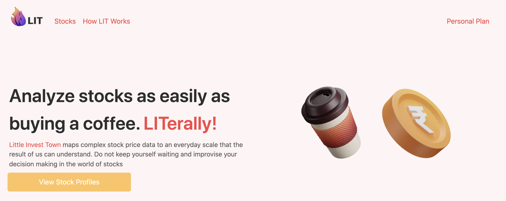
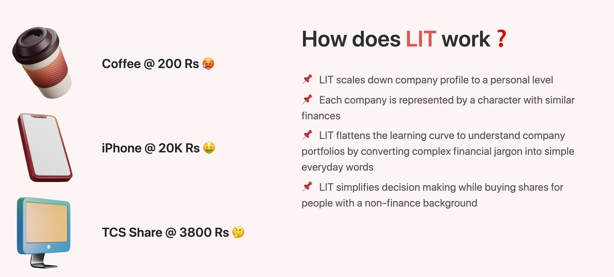
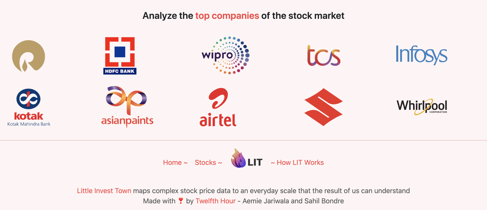
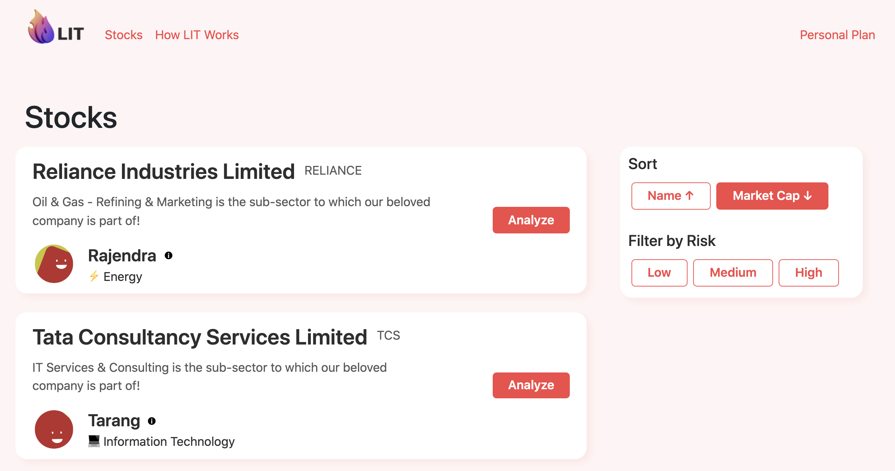
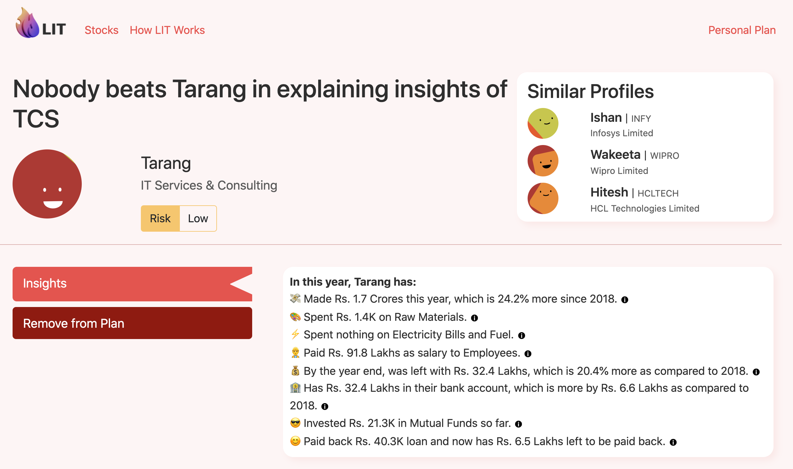
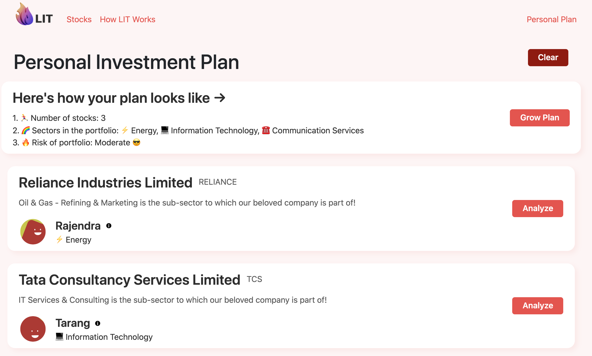

# LIT: Little Invest Town

`Theme: Finance Management`  
`Website: https://little-invest-town.vercel.app/`

# Problem Statement

Stock markets are hard to analyze and there has been a surge in the number of people starting to invest in the markets. Stock markets are liquid, available on mobile, good returns.

Not each user comes from a finanical background and it is harder to understand the figures present within the income and balance sheet. This is one of the reasons why individual constraint themselves from investing in stock market.

# Solution

To make it easy to invest in stock market, LIT provides the list of companies listed in the stock market and scale down company profiles and map them to individual financial profiles such that it is understood by any individual.

```
💡 Starbucks Coffee at Rs 20, Brand New iPhone at Rs 10K ⇒ Good Buy
ITC ⇒ Rs 220/Share ⇒ ????
ICICI ⇒ Rs 1.6 Lakh Crore Revenue ⇒ ????
```
As shown above, it is clearly understandable if starbucks coffee is available at Rs.20 it is a good buy however Rs. 220 per share of ITC Ltd confuses people. 

### Example Profile
Let's take the company RELIANCE, a well-known high profile company. Here, we map the finanical figures of RELIANCE to Alice. 

1. Alice makes and sells oil and electricity
2. In 2021 Alice made 50 Lakh Rupees
3. Last year she made 61 Lakh Rupees
4. Out of this, she could save up 5 Lakh Rupees which is 20% more than what she saved last year
5. Alice bought a new oil making machine for 3 Lakh Rupees
6. Alice also invested 5 Lakh rupees in Mutual Funds
7. Alice also paid her loan by 2 Lakh rupees and her loan now is 3.5 Lakhs

From the above points, we can conclude that **Alice is performing really well**. Looking at the point 4, Alice saved 20% more than last year which is clearly amazing. With this insights, it can be easily concluded that **RELIANCE is a good and safe company to invest in**.

# Tech Stack

## Front-end 
1. `Framework`: NextJS 
2. `Styling`: CSS, React-bootstrap
3. `Deployment`: Vercel, AWS EC2

## Back-end 
1. `Framework`: NodeJS, Express, Typescript 
2. `API`: REST API
3. `Deployment`: AWS EC2

# Setup on local computer
Clone the repo: `https://github.com/Twelfth-Hour/lit-little-invest-town.git`

## Client-side
Open a terminal and perform the following steps:

1. Move into the client directory: `cd client`
2. Change from production ➡️ development environment by moving to config directory and performing following changes:

    ```javascript
    // server.js
    const dev = "development";
    ```

    ```javascript
    // data.js
    const dev = "development";
    ```

3. Open the terminal again within the client directory and include the following commands: 
    ```bash
    $ yarn && yarn dev
    ```

4. Client side will be up and running on `http://localhost:3000`

## Server-side
Open a terminal and perform the following steps:

1. Move into the api directory: `cd api`
2. Within the API directory and include the following commands: 
    ```bash
    $ yarn && yarn dev
    ```

4. Server side will be up and running on `http://localhost:8080`

# UI Interface of LIT 

## Landing Page




## Stocks Page 


## Individual Stock ➡️ Profile Insight Page


## Personal Investment Plan Page


# Authors 
We, the team Twelfth Hour are the author of LIT. Follow us if you find us interesting 💻😄 as we are two big time computer geeks. 

## Aemie Jariwala
📌 `Github`: https://github.com/AemieJ <br/>
📌 `LinkedIn`: https://www.linkedin.com/in/aemie-jariwala/ <br/>
📌 `Blog`: https://dev.to/aemiej <br/>
📌 `Website`: https://aemiej.netlify.app/ <br/>

## Sahil Bondre
📌 `Github`: https://github.com/godcrampy <br/>
📌 `LinkedIn`: https://www.linkedin.com/in/sahil-bondre/ <br/>
📌 `Blog`: https://dev.to/godcrampy <br/>
📌 `Website`: https://sahil.surge.sh/ <br/>